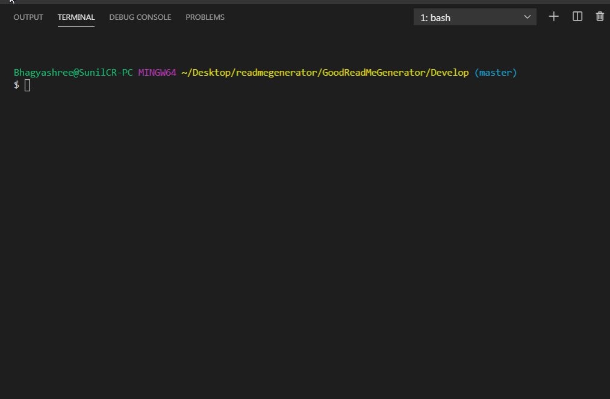

# Good Read Me Generator

## Description
To spend more time working on project,less time creating readme

## Table of Content
- License
- Usage
- Installation
- Contribution

## License
none

## Usage
Can easily Create readme

## Installation
npm install

## Contribution
Single contributor

## tests
node index.js

## Demo Gif

## Contributor
 

### Email: 
bhagyashree9402@gmail.com
